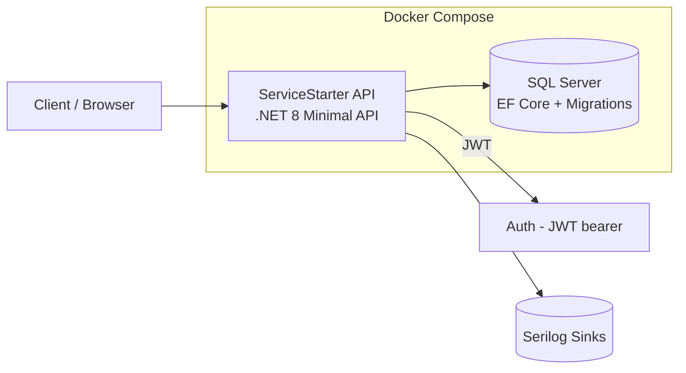

# C4 Container Diagram

```mermaid
flowchart LR
    client[Client / Browser] --> api[ServiceStarter API
                                    .NET 8 Minimal API];
    api --> db[(SQL Server
                EF Core + Migrations)];
    api -->|JWT| auth[Auth - JWT bearer];
    api --> logs[(Serilog Sinks)];

    subgraph Docker Compose
        api
        db
    end
```
